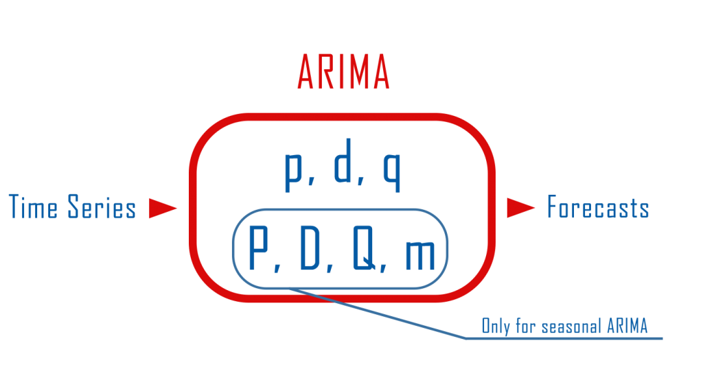
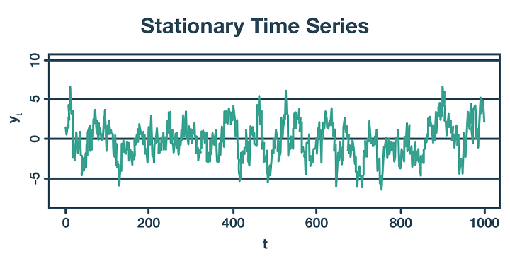
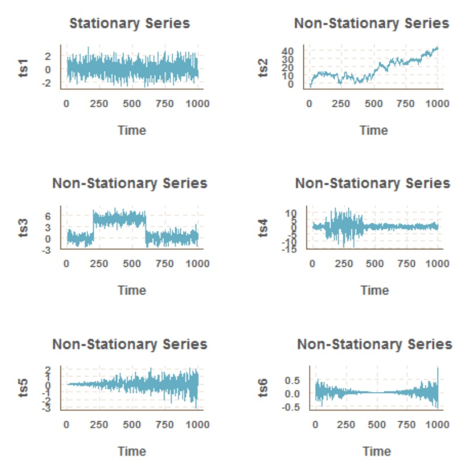

# forecasting_ARIMA_models

## Overview

   

## 

   

## 

   

##Holtwinters Exponential Smoothing

The Holt-Winters method uses exponential smoothing to encode lots of values from the past and use them to predict “typical” values for the present and future. Exponential smoothing refers to the use of an exponentially weighted moving average (EWMA) to “smooth” a time series.
